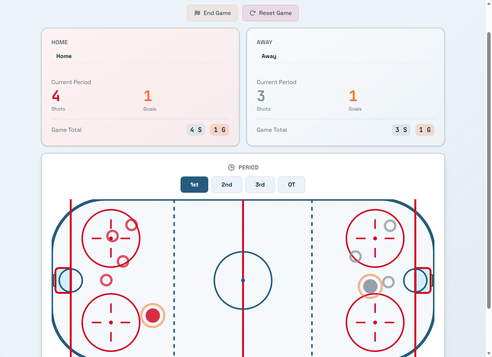
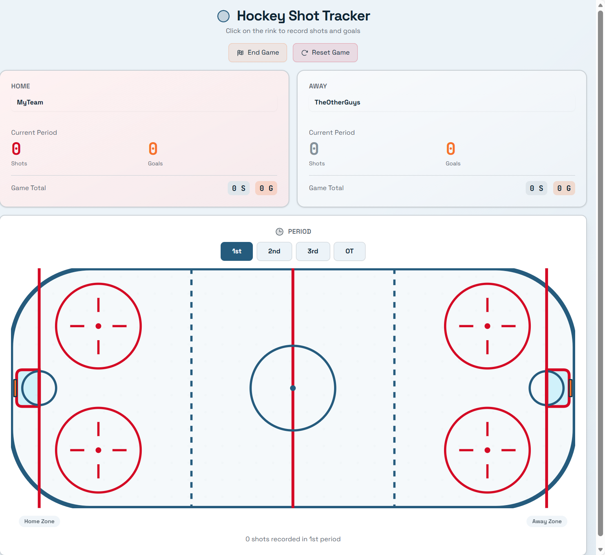

# Hockey Shot Tracker 🏒

A touch-based web application for tracking hockey shots during games. Built with an interactive NHL-style rink interface, this app allows coaches, analysts, and enthusiasts to record shot locations, track goals, and analyze shooting patterns in real-time—right from the bench or stands.

**No account required** - All data is stored locally on your device during the session. Export your shot charts as images or PDFs when the game ends.

## Features

- **Touch-Enabled NHL-Style Rink** - Touch directly on the rink to mark exactly where shots were taken
- **Quick Shot Entry** - Swipe and tap gestures for fast shot recording during live play
- **Shot Tracking** - Record shot location, type, and outcome (goal, save, miss, blocked)
- **Mobile-First Design** - Built for phones and tablets with large touch targets and intuitive gestures
- **Game Management** - Track shots by period, team, and player
- **Real-Time Statistics** - View shot totals, shooting percentages, and shot distribution
- **Shot Heat Maps** - Visualize shooting patterns and high-danger areas
- **Local Storage** - All data stays on your device, no account needed
- **Export Options** - Save your shot chart and stats as an image (PNG) or PDF
- **Progressive Web App (PWA)** - Install on your home screen for app-like experience

## NHL Rink Specifications

The app uses official NHL regulation rink dimensions for accurate shot tracking:

| Dimension | Measurement |
|-----------|-------------|
| **Rink Size** | 200 ft × 85 ft (61.0 m × 25.9 m) |
| **Corner Radius** | 28 ft (8.5 m) |
| **Goal Line** | 11 ft from end boards |
| **Blue Lines** | 75 ft from end boards, 50 ft apart |
| **Center Line** | 100 ft from each end |
| **Faceoff Circles** | 30 ft diameter |
| **Goal Opening** | 72" wide × 48" tall |
| **Crease Radius** | 6 ft |
| **Trapezoid** | 22 ft at goal, 28 ft at boards |

**Reference Diagrams:**
- [NHL Hockey Rink (Wikipedia SVG)](https://en.wikipedia.org/wiki/Ice_hockey_rink#/media/File:NHL_Hockey_Rink.svg)
- [Ice Hockey Layout (Wikipedia SVG)](https://en.wikipedia.org/wiki/Ice_hockey_rink#/media/File:Ice_hockey_layout.svg)

See [project spec.md](project%20spec.md) and [ascii-example-spec.md](ascii-example-spec.md) for detailed implementation specifications.

## Screenshots

### Main Game View


### Mobile View


### Period Selection


## Getting Started

### Prerequisites

- Node.js (v18 or higher)
- npm or yarn

### Installation

1. Clone the repository
   ```bash
   git clone https://github.com/ebmarquez/hockey-shot-tracker.git
   cd hockey-shot-tracker
   ```

2. Install dependencies
   ```bash
   npm install
   ```

3. Start the development server
   ```bash
   npm run dev
   ```

4. Open your browser and navigate to `http://localhost:3000`

### Building for Production

```bash
npm run build
```

## Usage

### Starting a New Game

1. Enter home and away team names
2. Optionally add player rosters
3. Tap **Start Game** to begin tracking

### Recording a Shot

1. Tap the team badge for the team taking the shot
2. Touch the rink where the shot originated
3. Tap the shot type (wrist, slap, snap, backhand, tip)
4. Tap the result (goal, save, miss, or blocked)
5. Optionally tap a player to assign the shot

### Touch Gestures

| Gesture | Action |
|---------|--------|
| **Single tap on rink** | Mark shot location |
| **Tap and hold on shot** | Edit or delete shot |
| **Swipe left on shot** | Quick delete |
| **Pinch zoom** | Zoom in/out on rink |
| **Two-finger drag** | Pan around zoomed rink |

### Managing the Game

- Tap period buttons to switch between 1st, 2nd, 3rd, and OT
- View live shot counts and statistics in the header
- Tap **Undo** to remove the last shot if entered incorrectly

### Exporting Your Data

At any time (or when the game ends):

1. Tap the **Export** button
2. Choose your format:
   - **PNG Image** - Shot chart with all shots plotted on the rink
   - **PDF Report** - Full summary including shot chart, statistics, and shot list
3. Save or share the file directly from your device

## Tech Stack

| Category | Technology |
|----------|------------|
| Frontend | React |
| Styling | Tailwind CSS |
| Touch Handling | React Touch Events / Hammer.js |
| State Management | React Context + useReducer |
| Local Storage | localStorage / sessionStorage |
| Export - Image | html2canvas |
| Export - PDF | jsPDF |
| PWA | Workbox |

## Data Storage

All data is stored locally on your device using browser storage APIs:

| Storage Type | Purpose |
|--------------|---------|
| **sessionStorage** | Current game data (cleared when browser closes) |
| **localStorage** | User preferences, recent team names (persists between sessions) |

### Data Persistence

- **During a game**: Shot data is saved to `sessionStorage` after each shot, protecting against accidental page refreshes
- **Between sessions**: Team names and preferences are saved to `localStorage` for convenience
- **Privacy**: No data ever leaves your device unless you explicitly export it

## Project Structure

```
hockey-shot-tracker/
├── public/
│   ├── icons/              # PWA icons
│   └── manifest.json       # PWA manifest
├── src/
│   ├── components/
│   │   ├── Rink/           # NHL rink SVG and touch interaction
│   │   ├── ShotMarker/     # Shot position markers
│   │   ├── ShotForm/       # Shot entry form (touch-optimized)
│   │   ├── GameControls/   # Period and team controls
│   │   ├── Statistics/     # Stats display
│   │   └── Export/         # Export to PNG/PDF
│   ├── hooks/
│   │   ├── useGameState.ts # Game state management
│   │   ├── useLocalStorage.ts # localStorage hook
│   │   ├── useTouchHandlers.ts # Touch gesture handling
│   │   └── useExport.ts    # Export functionality
│   ├── context/
│   │   └── GameContext.tsx # Game state context
│   ├── types/              # TypeScript type definitions
│   ├── utils/
│   │   ├── storage.ts      # Storage utilities
│   │   ├── touch.ts        # Touch coordinate utilities
│   │   ├── exportImage.ts  # PNG export logic
│   │   └── exportPDF.ts    # PDF export logic
│   └── App.tsx
├── package.json
└── README.md
```

## Data Model

### Shot

| Field | Type | Description |
|-------|------|-------------|
| `id` | string | Unique identifier (UUID) |
| `period` | 1 \| 2 \| 3 \| 'OT' | Game period |
| `timestamp` | number | Unix timestamp |
| `team` | 'home' \| 'away' | Team taking the shot |
| `playerNumber` | number? | Optional player number |
| `playerName` | string? | Optional player name |
| `x` | number | X coordinate (0-100, % from left) |
| `y` | number | Y coordinate (0-100, % from top) |
| `shotType` | string | wrist, slap, snap, backhand, tip |
| `result` | string | goal, save, miss, blocked |

### Game

| Field | Type | Description |
|-------|------|-------------|
| `id` | string | Unique identifier (UUID) |
| `date` | string | Game date (ISO format) |
| `homeTeam` | string | Home team name |
| `awayTeam` | string | Away team name |
| `currentPeriod` | number | Active period |
| `shots` | Shot[] | Array of all shots |
| `homePlayers` | Player[]? | Optional home roster |
| `awayPlayers` | Player[]? | Optional away roster |

## Export Formats

### PNG Image Export
- Full rink visualization with all shots plotted
- Color-coded markers (goals vs. saves/misses)
- Team legends and shot counts
- Period breakdown
- High resolution for sharing or printing

### PDF Report Export
- **Page 1**: Shot chart visualization
- **Page 2**: Game summary statistics
  - Total shots by team
  - Goals and shooting percentage
  - Shots by period
  - Shot type breakdown
- **Page 3**: Detailed shot list (time, location, player, result)

## Touch Optimization

This app is designed for real-time use during games on mobile devices:

- **Large touch targets** - Minimum 44x44px for all interactive elements
- **No hover states** - All interactions work with touch only
- **Gesture support** - Familiar mobile gestures (tap, swipe, pinch)
- **Haptic feedback** - Vibration on shot entry (where supported)
- **Portrait & landscape** - Responsive layout adapts to device orientation
- **Accidental touch prevention** - Confirmation for destructive actions
- **One-handed operation** - Key controls accessible with thumb

## Roadmap

- [ ] Core rink interface with touch-based shot marking
- [ ] Shot entry form with large touch targets
- [ ] Game setup (team names)
- [ ] Period management
- [ ] Session storage for data persistence
- [ ] Real-time shot statistics
- [ ] Undo last shot
- [ ] Touch gestures (hold to edit, swipe to delete)
- [ ] Pinch-to-zoom on rink
- [ ] PNG image export
- [ ] PDF report export
- [ ] Shot heat map visualization
- [ ] Haptic feedback for shot entry
- [ ] Optional player roster management
- [ ] localStorage for user preferences
- [ ] PWA support for home screen installation
- [ ] Share directly to social media / messaging apps

## Browser Support

| Browser | Support |
|---------|---------|
| Chrome (Android) | ✅ Full support |
| Safari (iOS) | ✅ Full support |
| Firefox (Android) | ✅ Full support |
| Edge | ✅ Full support |
| Samsung Internet | ✅ Full support |

## Contributing

Contributions are welcome! Please feel free to submit a Pull Request.

1. Fork the repository
2. Create your feature branch (`git checkout -b feature/AmazingFeature`)
3. Commit your changes (`git commit -m 'Add some AmazingFeature'`)
4. Push to the branch (`git push origin feature/AmazingFeature`)
5. Open a Pull Request

## License

This project is licensed under the MIT License - see the [LICENSE](LICENSE) file for details.

## Acknowledgments

- [NHL](https://www.nhl.com/) for the standard rink dimensions and layout
- [Wikipedia Ice Hockey Rink article](https://en.wikipedia.org/wiki/Ice_hockey_rink) for detailed specifications and reference diagrams
- Hockey analytics community for inspiration

---

**Made with ❤️ for hockey fans and analysts**

*No data leaves your device. Your shots, your data, your control.*
